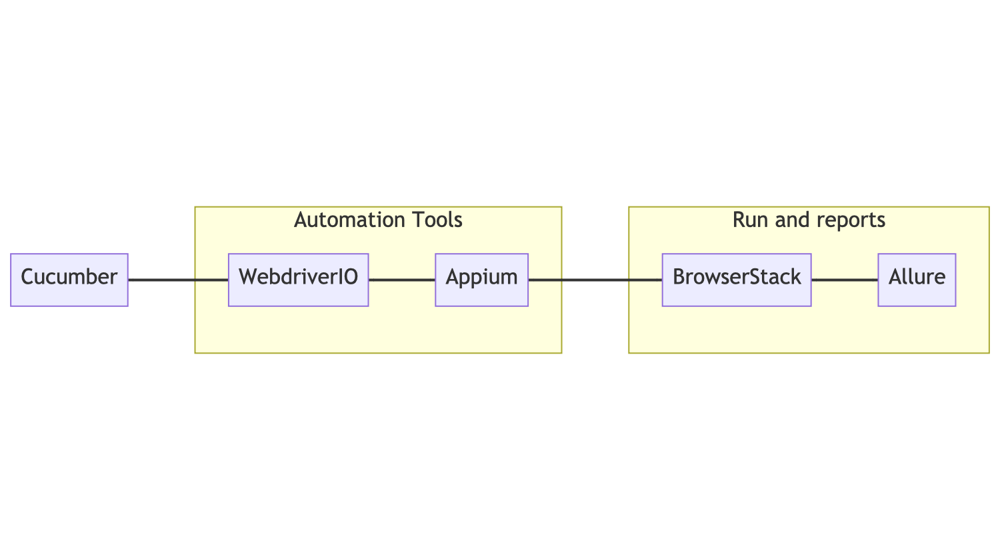
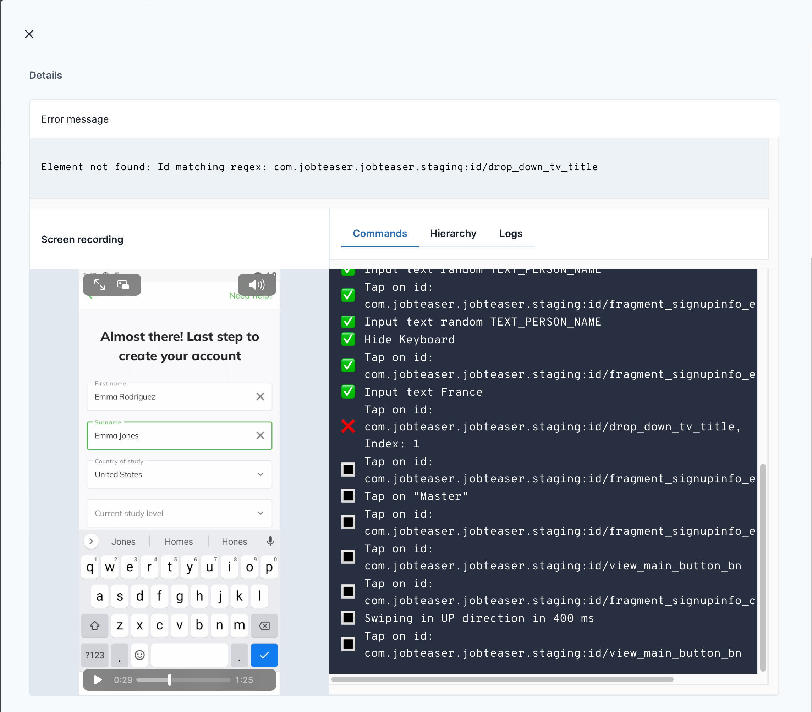
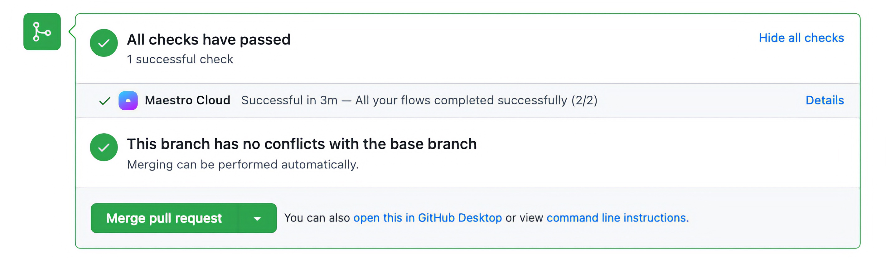
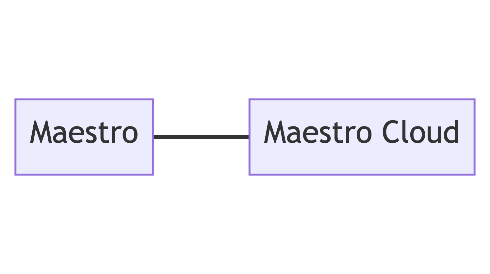

slidenumbers: true
slide-transition: false

# [fit] Become a **Maestro** of Mobile Testing
# [fit] in **5** minutes

---

# Hello :wave:

**Romain Rivollier** - *Staff Engineer*
**Jordan Dahnoun** - *Engineer Manager*


## Helping **students** finding their first **job** on


---
# Objectives of this **talk** 

- Better understand *Shift Left* and **End-to-End testing**
- Introduce **Maestro** and how to integrate it in your processes

---

# **Shift Left** in Mobile Engineering

- Catch bugs before the **release**
- Shipping your *mobile app* with **confidence**


---
# **Shift Left** in Mobile Engineering


---
# **Shift Left** in Mobile Engineering


---

# [fit] **End to End** testing

---

# Story Time

---

# Back in the day

- Reboot **JobTeaser** mobile app in 2019
- Write it with End to End testing in mind
- Build a new test stack

^ 
- We reboot the mobile app (Android and iOS) in 2019. 
- The company globaly shifting to end to end testing (mobile and web product) so the app was build along side end to end tests
- We built a new testing stack to write test once and run them on Android and iOS

---

# The stack



^ 
We finished with this stack:
- Cucumber that describe tests in a kind of natural language to make test easy to write and easy to read
- WebdriverIO with Appium to write test implementations and communicate with devices
- Tests are executed on a device farm hosted by BrowserStack and test report were built with allure.
- You don't know all these technologies don't worry

---

# A test


```gherkin
@resetApp @iOS @android
Feature: [Landing] Landing

Scenario: SignIn
    Given I am on "landing" view
    When  I click on "already have an account"
    Then  I am on "sign in email" view
```

^
This at the end how a test looked like
as you can see this test for the landing view
tests are shared between Android and iOS app
Really easy to read the scenario and understand what is it doing$
BUT...

--- 

```typescript
interface ILandingSelectors extends SelectorCollection {
    'sign in button': Selector;
    'sign up button': Selector;
}

export abstract class Landing<T extends ILandingSelectors> extends View<T> {
    protected lists = [];
    protected widgets = [];
    protected url = undefined;
    protected navigationSteps = [
        async (): Promise<void> => {
            await this.waitForExist();
        },
    ];
}

class LandingAndroid extends Landing<typeof AndroidSelectors> {
    protected selectors = {
	    'sign up button': new AndroidIdSelector('fragment_landing_bn_sign_up'),
	    'sign in button': new AndroidIdSelector('fragment_landing_bn_sign_in')
		};
}

const viewDef: IViewDefinition = {
    android: LandingAndroid,
    gherkinName: 'landing',
};
```

^
The page implementation need a lot of typescript code like:
- defining elements for both platform
- implement navigation logic
- and I don't speak about the initial implementation of some concept like View that is not builtin

---

# Pros

- Write tests at the same time we develop screen
- Good pace (at first)
- Detect bugs and regressions early

^
So developing tests at the same time we built the app was cool and we learn good practice 
The pace was good until the app flows grow and become more and more complex
Save us from a lot of hot fix

---

# Cons

- Adaptation to the stack
- Complex to maintain with app evolution
- Time consuming
- Lost of motivation from engineers

^
Stack is complex and need some adaptation for mobile engineers (Typescript, Gerkin)
Luckily we've got helps from our QA engineers
Updating some tests has be harder du to app flow implementation complexity
This lead to more and more time consumed to maintains tests and even write them

---

# Maestro :musical_keyboard:

---

# Maestro

- Created in 2022 by mobile.dev
- *Kotlin* open source project
- Cross-platform (Android, iOS, ...)
- **Simple** to use

---

# Show me your flow!

- Flow describe a *test*
- Write in *yaml*
- Declarative and **simple** syntax
- Composable (flows can call each other)

---

# Simple commands

```yaml
- tapOn: "element.id" #tap on UI element
- assertVisible: "element.id" #check if the element is present
- inputText: "a text" #Input text with keyboard
- back #tap on back button 
```

---

# Simple structure

```yaml
- launchApp:
    appId: my.super.app.id
    clearState: true
- tapOn: my.button.id
- swipe:
    direction: DOWN
- assertVisible: user.profile.name
```

---

# Maestro Studio

---

# Maestro Studio

- No-Code UI Automation 
- Record Maestro commands directly from your app
- Inspect UI element
- Export recording directly to flow file

---


---

[.text: alignment(center)]

[.column]

:+1:


- **Easy** to record a flow
- app interaction in *real time*
- no dependency

[.column]

:-1:


- Don't have access to *all* test commands
- Cannot update a current test

---

## Real *world* example with **Android Makers** app

^
Time to play with a real app and we took the android makers appp from the playstore

---
# The test


1. Find our talk 
- open it
- check if we are the speakers
- put it in favorite
- filter talks by favorite
- check if our is present

^
we were a little anxious about the fact our talk will really happen 
so we write a little test to check if the talk will occurs and we are the speakers :D


---


^
Before check the test code let's look at the test running,
the terminal is not very interesting it just list the steps of the test and put a green checkmark when it's done.
Maesto take each command and execute them, it's capable of handling some lag du to API call for example 


---

```yaml
- scrollUntilVisible:
    element: "Become a Maestro of Mobile Testing in 5 minutes"
    direction: "DOWN"
- tapOn: "Become a Maestro of Mobile Testing in 5 minutes"
- assertVisible:
    text: "Jordan Dahnoun"
- assertVisible:
    text: "Romain Rivollier"
- tapOn: "Favorite"
- tapOn: "Back"
- tapOn:
    point: "81%,7%"
- tapOn:
    text: "Favorite"
    index: 1
- tapOn:
    point: "81%,7%"
- assertVisible: "Become a Maestro of Mobile Testing in 5 minutes"
```

^
10 steps to write this test, in 2 minutes with maesto studio
In term of practice this test is not the best because the actual version of the app lack of accessibility id 
and we need to query ui element via the string content but for this demo, it's okay

---

## Integration in your development flow

---

## Maestro Cloud

- CI dedicated to run your flows
- Reporting
- Run only on simulators
- Integration to Github PR

---



---



---

## Run maestro directly on your CI 

- You setup your test environment
- very light report when flow fails (Junit report)

---

# Are we **happy**?

---

# Conclusion

- Reporting less powerfull
- young product so some bug can appear
- limited to simulator for the moment
- The best experience is tied to theirs cloud platform

---

# Conclusion

- New tests are faster to write
- Costs can be lower
- maestro product moving fast
- Reduce maintenance to zero

---

# Previous stack


---

# New stack


---

#Ressources :books:

- Shift Left in Mobile Engineering: [The Shift Left in Mobile Engineering by mobile.dev](https://blog.mobile.dev/the-shift-left-in-mobile-engineering-63fdbb3e34e2)

- Maestro: [https://maestro.mobile.dev](https://maestro.mobile.dev)
- Maestro Github: [https://github.com/mobile-dev-inc/maestro](https://github.com/mobile-dev-inc/maestro)

---

# [fit] **Questions?** :raising_hand: