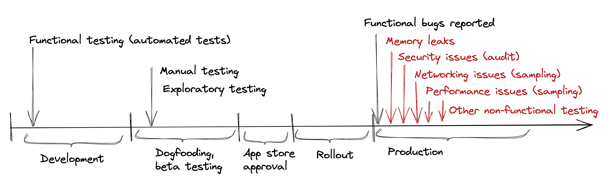
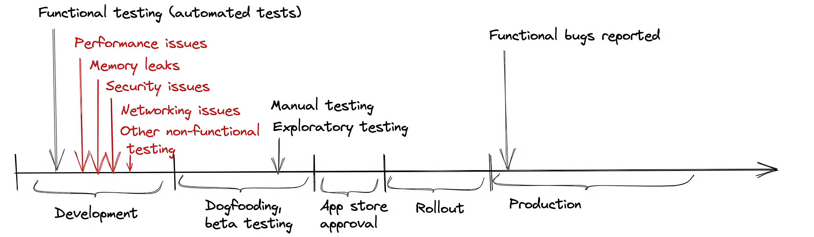

slidenumbers: false
slide-transition: false

# [fit] Become a **Maestro** of Mobile Testing
# [fit] in **5** minutes

---

# Hello :wave:

**Romain Rivollier** - *Staff Engineer*
**Jordan Dahnoun** - *Engineer Manager*


## Helping **students** finding their first **job** on


---
# Objectives of this **talk** 

- Better understand *Shift Left* and **End-to-End testing**
- Introduce **Maestro** and how to integrate it in your processes

---

# **Shift Left** in Mobile Engineering

- Catch bugs before the **release**
- Shipping your *mobile app* with **confidence**


---
# **Shift Left** in Mobile Engineering



---
# **Shift Left** in Mobile Engineering



---

# [fit] **End to End** testing

---

# Experience

---

# Back in the day

- Reboot **JobTeaser** mobile app in 2019
- Write it with End to End testing in mind
- Build a new test stack

---

# The stack

- **Appium**: Automation backend 
- **Webdriverio**: Communicate with Appium via the webdriver protocol
- **Cucumber**: Write tests in (kind of) natural language

---

# A test


```gherkin
@resetApp @iOS @android
Feature: [Landing] Landing

Scenario: SignIn
    Given I am on "landing" view
    When  I click on "sign in button"
    Then  I am on "sign in email" view
```

---

```typescript
interface ILandingSelectors extends SelectorCollection {
    'sign in button': Selector;
    'sign up button': Selector;
}

export abstract class Landing<T extends ILandingSelectors> extends View<T> {
    protected lists = [];
    protected widgets = [];
    protected url = undefined;
    protected navigationSteps = [
        async (): Promise<void> => {
            await this.waitForExist();
        },
    ];
}

class LandingAndroid extends Landing<typeof AndroidSelectors> {
    protected selectors = {
	    'sign up button': new AndroidIdSelector('fragment_landing_bn_sign_up'),
	    'sign in button': new AndroidIdSelector('fragment_landing_bn_sign_in')
		};
}

const viewDef: IViewDefinition = {
    android: LandingAndroid,
    gherkinName: 'landing',
};
```

---

# Experience

- Write tests at the same time we develop screen
- Good pace
- Detect bugs and regressions early

---

# Cons

- Complex to maintain with app evolution
- Time consuming
- Adaptation to the stack

---


# Maestro

---

# Maestro

- *Kotlin* open source project
- Cross-platform (Android, iOS, React Native, Flutter)
- **Simple** setup
- No dependency

---

# Show me your flow!

- Flow describe a *test*
- Write in *yaml*
- Declarative and **simple** syntax
- Composable

---

# Simple commands

```yaml
- tapOn: "element.id" #tap on UI element
- assertVisible: "element.id" #check if the element is present
- inputText: "a text" #Input text with keyboard
- back #tap on back button 
```

---

# Simple structure

```yaml
appId: my.super.app.id
---
- launchApp:
    appId: my.super.app.id
    clearState: true
- tapOn: my.button.id
- assertVisible: user.profile.name
- swipe:
    direction: DOWN
```

---

# Lazy to write **yaml**?

---

# Maestro Studio

---

# Maestro Studio

- No-Code UI Automation 
- Record Maestro commands directly from your app
- Inspect UI element
- Export recording directly to flow file

---


---

[.text: alignment(center)]

[.column]

:+1:

Run you test live

[.column]

:-1:

Don't have access to all commands

---

## Real *world* example with **Android Makers** app

---
# The test

1. Find our talk 
- open it
- check if we are the speakers
- put it in favorite
- filter talks by favorite
- check if our is present

---

```yaml
- scrollUntilVisible:
    element: "Become a Maestro of Mobile Testing in 5 minutes"
    direction: "DOWN"
- tapOn: "Become a Maestro of Mobile Testing in 5 minutes"
- assertVisible:
    text: "Jordan Dahnoun"
- assertVisible:
    text: "Romain Rivollier"
- tapOn: "Favorite"
- tapOn: "Back"
- tapOn:
    point: "81%,7%"
- tapOn:
    text: "Favorite"
    index: 1
- tapOn:
    point: "81%,7%"
- assertVisible: "Become a Maestro of Mobile Testing in 5 minutes"
```

---


---

## Integration in your development flow

---

#Ressources:

- Shift Left in Mobile Engineering: [The Shift Left in Mobile Engineering by mobile.dev](https://blog.mobile.dev/the-shift-left-in-mobile-engineering-63fdbb3e34e2)

- Maestro: [https://maestro.mobile.dev](https://maestro.mobile.dev)
- Maestro Github: [https://github.com/mobile-dev-inc/maestro](https://github.com/mobile-dev-inc/maestro)